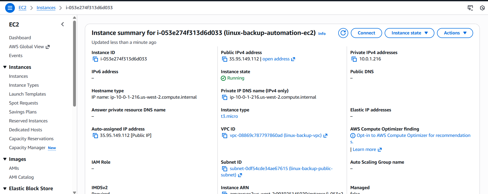
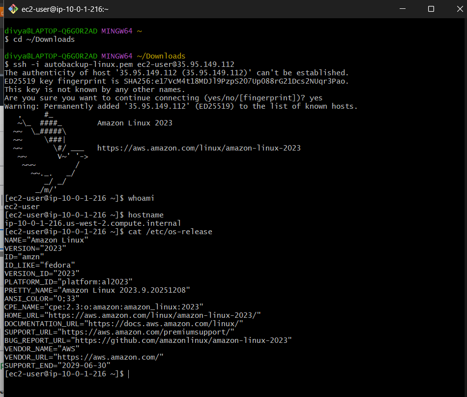
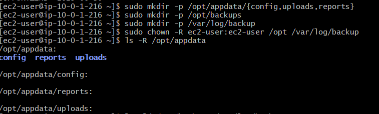
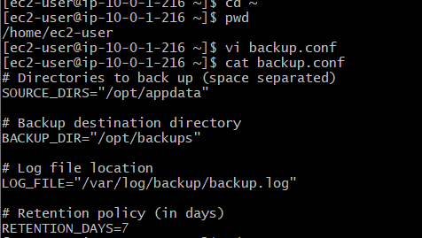
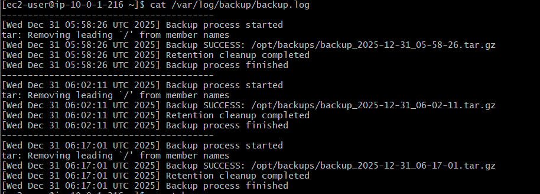
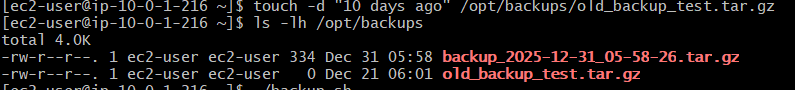
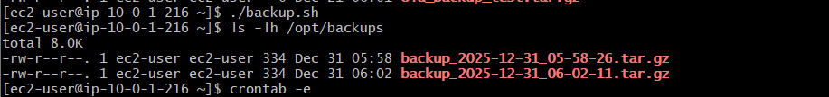
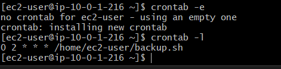

# Linux Server Automation & Backup System on AWS

## 📌 Project Overview
This project demonstrates a **Linux-based automated backup system** deployed on an AWS EC2 instance.  
The solution is **config-driven**, uses **Bash scripting**, maintains **logs**, enforces a **retention policy**, and runs automatically using **cron scheduling**.

The goal of this project is to simulate **real-world Linux server administration and automation tasks** commonly performed in production environments.

---

## 🏗️ Architecture Overview
- Custom VPC with public subnet
- Internet Gateway & route table for internet access
- Amazon Linux EC2 instance
- Secure SSH access using key-based authentication
- Linux filesystem best practices

---

## 🔐 Secure SSH Access
The EC2 instance is accessed securely using SSH with key-based authentication.  
Access is restricted using security groups following **least privilege principles**.

---

## 📂 Production Directory Structure
Linux filesystem best practices were followed by separating application data, backups, and logs.

- `/opt/appdata` → Application data  
- `/opt/backups` → Backup archives  
- `/var/log/backup` → Backup logs  

---

## ⚙️ Configuration File (Config-Driven Design)
All paths, retention settings, and log locations are externalized using a configuration file.  
This improves **reusability**, **maintainability**, and **environment portability**.

**File:** `backup.conf`

---

## 🤖 Backup Automation Script
The backup automation is implemented using a Bash script that:
- Reads values from the configuration file
- Creates timestamped `.tar.gz` backups
- Logs execution status
- Handles errors gracefully
- Applies retention policy automatically

**File:** `backup.sh`

.png)

---

## ✅ Backup Execution Proof
Successful execution of the script creates compressed backup archives in the backup directory.

.png)

---

## 📝 Logging & Monitoring
All backup operations are logged for **auditability and troubleshooting**.  
Logs include:
- Backup start & end time
- Success or failure status
- Retention cleanup actions

---

## ♻️ Retention Policy Validation
A retention policy ensures that backups older than a defined number of days are automatically deleted.

### Before Retention Cleanup
An old backup file (older than 7 days) was manually created to simulate aging data.

### After Retention Cleanup
After running the script, the old backup was automatically removed.

---

## ⏰ Cron Job Automation
The backup script is scheduled to run **daily at 2:00 AM** using cron, ensuring **fully automated backups** without manual intervention.
0 2 * * * /home/ec2-user/backup.sh

---

## 🔐 Security Best Practices Implemented
- SSH access restricted using security groups
- Key-based authentication (no passwords)
- Limited file permissions on scripts and backup directories
- No hard-coded credentials

---

## 🧠 Key Learnings
- Linux filesystem hierarchy & permissions
- Bash scripting for automation
- Config-driven script design
- Cron job scheduling
- Backup retention strategies
- AWS EC2 & basic VPC networking
- Real-world Linux troubleshooting

---

## 🎯 Use Cases
- Linux system administration
- Cloud operations & support roles
- DevOps / SRE foundational automation
- Production backup & maintenance tasks

---

## 📌 Conclusion
This project reflects **hands-on Linux administration skills** combined with **cloud infrastructure knowledge**.  
It simulates a real production backup solution and demonstrates readiness for **Cloud Engineer / Linux Admin / DevOps trainee roles**.# linux-backup-automation
